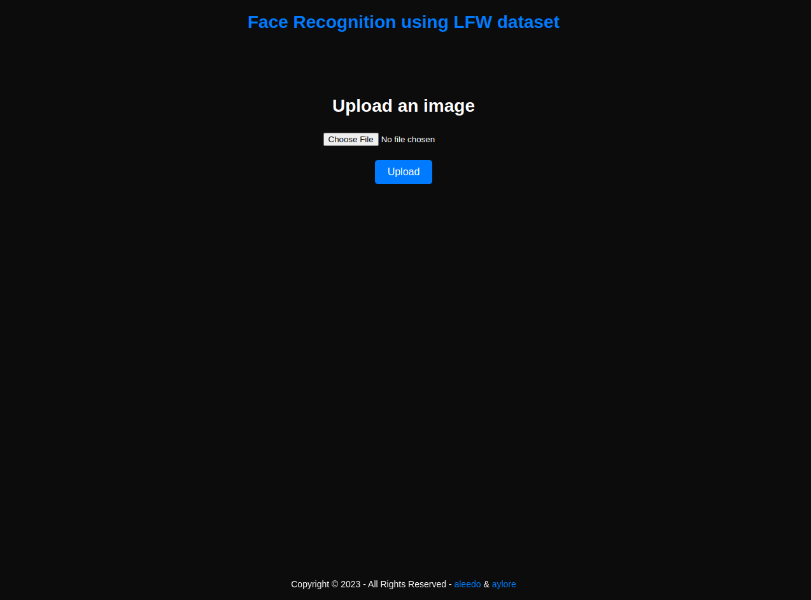
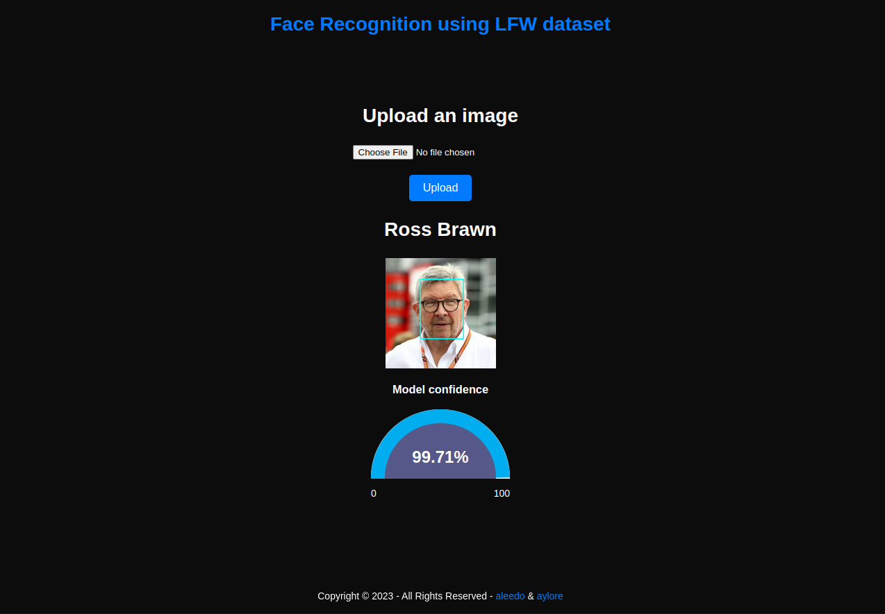

# Face Recognition with VGGface Model

# Overview
This project aims to leverage the power of deep learning and the VGGface model to perform face recognition on input images. Face recognition is a popular application of computer vision that involves identifying and verifying the identity of a person based on their facial features. The VGGface model, trained on the LFW (Labeled Faces in the Wild) dataset, provides an excellent foundation for accurate and reliable face recognition.

# Usage
1. Clone this repository to your local machine.
2. Install the required dependencies `pip install -r requirements.txt`
3. Run the utils/predict.py script.
4. To train or fine tune the model view the utils/train.py script. NOTE: code adjustments may be required.

# Deployment
PythonAnywhere is a popular online platform that allows you to host, run, and deploy Python applications in the cloud. Deploying your face recognition project, which utilizes the VGGface model, on PythonAnywhere can provide a convenient and accessible way to make your application available to users. [view_here](http://ayolore.pythonanywhere.com/from_file/)

# Model in Action  

# Live Demo on PythonAnyWhere.com

https://github.com/aleedo/Face-Recognition-VggFace-Yolo/assets/62552716/321d9fb1-4d2c-449e-80e6-2588499f8062

# There is a lot of surprises left for the curious user, HAVE FUN YA AMGAD.

# Acknowledgements
* The VGGface model was developed by the Visual Geometry Group at the University of Oxford.
* The LFW dataset was created by the University of Massachusetts, Amherst and the University of Texas, Austin.

